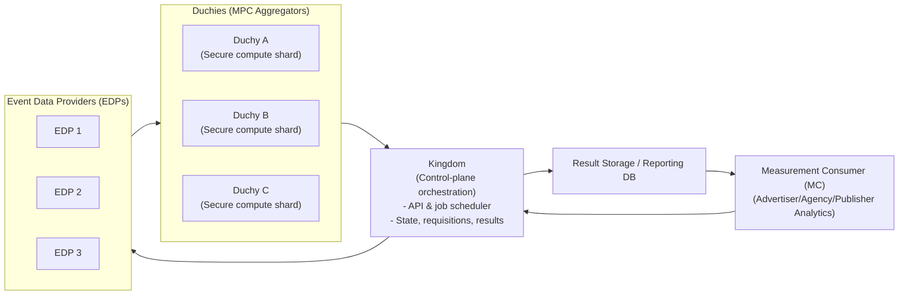
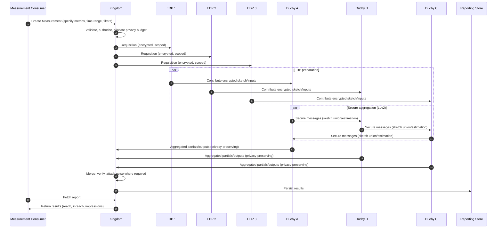
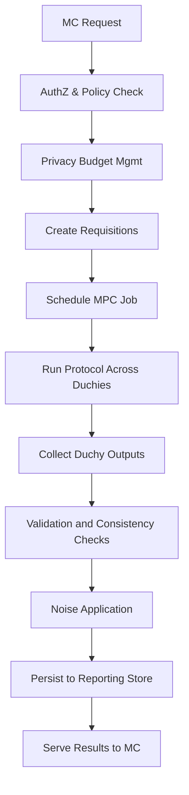

### Cross-Media Computation: Architecture, Flow, and Protocols

This document explains how cross-media computation works in the CMM system, the roles of Duchies and the Kingdom, how data flows end-to-end, and which protocols are used to compute reach/frequency and related metrics while preserving privacy. Diagrams use Mermaid for clarity and portability.

Contents
- High-level architecture and actors
- End-to-end data flow
- Role of Duchies and the Kingdom
- Cryptographic protocols and MPC flows (Liquid Legions v2)
- Measurement lifecycle (from request to result)
- Privacy budget, noise, and post-processing
- Failure handling, retries, and data integrity
- Glossary

### High-level architecture and actors



- Measurement Consumer (MC): Defines measurements/reports (e.g., reach, k+ reach, impressions) and retrieves results.
- Kingdom: Control-plane service that authenticates, authorizes, issues requisitions to EDPs, tracks state, orchestrates privacy-preserving secure computation across Duchies, and gathers results.
- Duchies: Independent aggregation parties that execute the secure MPC protocol (e.g., Liquid Legions v2) without learning raw user identifiers or per-EDP secrets. Multiple Duchies reduce trust in any single party.
- EDPs: Data owners (e.g., platforms or publishers) that contribute encrypted/obfuscated measurement inputs.

### End-to-end data flow (overview)



Key properties
- EDPs never share raw user-level identifiers; they share encrypted/obfuscated sketches or ciphertexts.
- Duchies jointly compute aggregates; no single Duchy can reconstruct raw inputs.
- Kingdom orchestrates, enforces policy/ACLs, manages privacy budgets, and assembles final results.

### What do the Duchies do?

Duchies are compute-only parties that jointly run the secure aggregation protocol. Typical responsibilities:
- Receive encrypted inputs or prepared sketches from EDPs (directly or via orchestrated channels).
- Execute the Liquid Legions v2 (LLv2) protocol steps across Duchies:
  - Secure set union cardinality estimation
  - Overlap handling to get union reach
  - k+ reach estimation based on sketch decoding
  - Optional impression constraints and consistency relations
- Add protocol-required randomness/noise and boundary protections (per policy).
- Produce privacy-preserving partials or final aggregates for the Kingdom to collect.

Why multiple Duchies?
- Trust is distributed. A single Duchy cannot learn sensitive data; collusion across all Duchies would be needed to break privacy.
- Each Duchy runs under separate operational control domains (recommended) to minimize systemic risk.

### How does the Kingdom work?

The Kingdom is the orchestrator/control-plane:
- API and AuthZ: Accepts measurement requests from MCs; checks permissions and policies.
- Requisition management: Contacts EDPs with scoped requests for encrypted inputs.
- Job scheduling: Plans and triggers MPC jobs across Duchies; tracks states, retries, and timeouts.
- Privacy budget and policy: Deducts privacy budget, enforces allowable noise mechanisms/mechanism parameters.
- Validation and result assembly: Gathers Duchy outputs, runs validation, attaches required noise, enforces consistency rules, and persists results.



### Cryptographic protocols and MPC flows

The system commonly uses Liquid Legions v2 (LLv2) for privacy-preserving reach and overlap estimation. LLv2 is a multi-party protocol that leverages:
- Probabilistic sketches for de-duplicated reach estimation across providers.
- Secure shuffling/blinding across Duchies to prevent data linkage.
- Noise addition and minimum thresholds to protect individual-level privacy.

At a high level:
- Each EDP converts its event identifiers (VIDs) into a privacy-preserving sketch.
- Duchies execute protocol rounds to combine sketches securely and estimate union reach and k+ reach.
- Output is a set of aggregates (reach, k-reach, sometimes intermediate counts) without revealing raw identities.

LLv2 multi-duchy data exchange (simplified):

```mermaid
flowchart LR
  subgraph Ingestion
    E1[EDP 1] --> Prep1[Prepare sketch (encrypt/obfuscate)]
    E2[EDP 2] --> Prep2[Prepare sketch (encrypt/obfuscate)]
    E3[EDP 3] --> Prep3[Prepare sketch (encrypt/obfuscate)]
  end

  Prep1 --> D1["Duchy A"]
  Prep2 --> D2["Duchy B"]
  Prep3 --> D3["Duchy C"]

  D1 --> M1[Secure combine/permute]
  D2 --> M2[Secure combine/permute]
  D3 --> M3[Secure combine/permute]

  M1 --> M2
  M2 --> M3
  M3 --> OUT[Union/k+ reach estimate]
```

Note: The repo contains proto packages under `src/main/proto/wfa` including `rlwe` and `private_membership` interfaces that back encryption, shuffling, and private set/aggregate operations in various workflows.

### Measurement lifecycle (from request to result)

```mermaid
flowchart TB
  Define[MC defines measurement\n(metrics, filters, window)]
  Submit[MC submits to Kingdom]
  Validate[AuthZ, schema, budget]
  Reqs[Requisitions to EDPs]
  Prep[EDPs prepare encrypted inputs]
  MPC[Kingdom schedules MPC across Duchies]
  Run[Run LLv2 rounds]
  Collect[Collect outputs]
  Check[Quality & consistency checks]
  Noise[Apply required noise]
  Store[Persist to reporting DB]
  Deliver[Deliver results to MC]

  Define --> Submit --> Validate --> Reqs --> Prep --> MPC --> Run --> Collect --> Check --> Noise --> Store --> Deliver
```

### Privacy budget, noise, and post-processing

- Privacy budget (DP accounting): The Kingdom tracks/measures the amount of privacy budget consumed by measurements. Requests exceeding budget or with incompatible noise mechanisms are rejected.
- Noise mechanisms: Depending on policy, (discrete) Gaussian or other calibrated mechanisms are used during/after aggregation.
- Post-processing and consistency: After aggregation, the reporting pipeline may apply consistency corrections across metrics (reach, k-reach, impressions) and over time. In this repo, see `src/main/python/wfa/measurement/reporting/postprocessing/report/report.py` for constraint definitions and solver usage. A separate explainer and diagrams are available in `docs/noise-correction-flow-mermaid.md`.

```mermaid
flowchart LR
  Raw[Aggregates from MPC] --> NoiseStep[Apply calibrated noise (policy)] --> Consistency[Constraint-based correction\n(reach/k-reach/impressions)] --> Final[Final report values]
```

### Failure handling, retries, and data integrity (abridged)

- Requisitions can expire; Kingdom tracks lifecycle and retries within policy.
- Duchy jobs have states; orchestrator can restart idempotent protocol steps.
- Integrity checks include: signature/identity validation, version compatibility, and basic invariants on measurement specs.
- Partial availability (EDP missing) can either fail the measurement, use fallbacks, or proceed per policy with explicit flags in results.

### Protocols, interfaces, and repos (pointers)

- Liquid Legions v2 (multi-party reach estimation)
- RLWE and Private Membership protocol protos in this repo (under `src/main/proto/wfa/...`) supporting secure computation components.
- Reporting post-processing pipeline:
  - `src/main/python/wfa/measurement/reporting/postprocessing/report/report.py`
  - Diagrams: `docs/noise-correction-flow-mermaid.md`

### Glossary

- EDP: Event Data Provider; an entity holding user-level events.
- MC: Measurement Consumer; organization requesting measurement results.
- Kingdom: Control-plane service coordinating requisitions and MPC.
- Duchy: Secure compute participant in MPC.
- LLv2: Liquid Legions v2; MPC protocol for privacy-preserving reach.
- k+ reach: Count of people reached at least k times.
- Impression: Total number of ad exposures shown.


