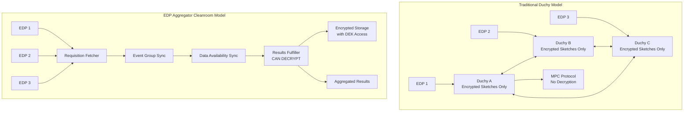
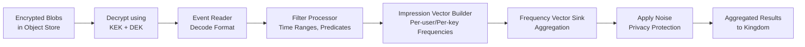
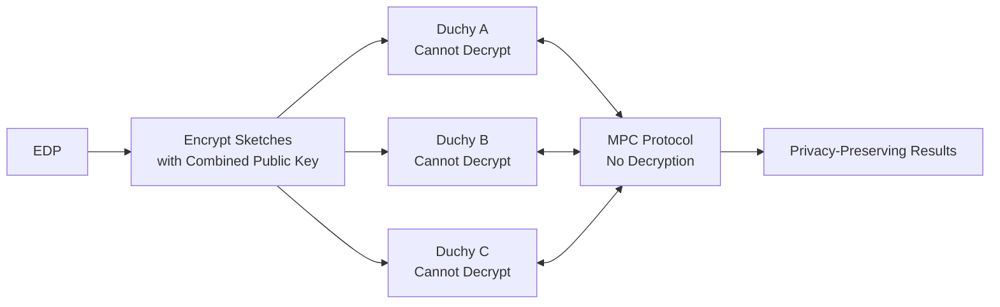
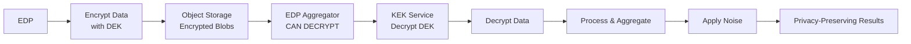

# EDP Aggregator Data Cleanroom: Architecture and Data Protection

This document addresses questions about how the EDP Aggregator data cleanroom works, what data access it provides, and how it differs from the current Duchy-based architecture.

## Questions Addressed

1. How is this data cleanroom intended to work?
2. What data will Aquila have access to in the data clean room?
3. How is this information protected in a different way than the current structure?

---

## 1. How is the Data Cleanroom Intended to Work?

The EDP Aggregator implements a **data cleanroom architecture** that differs fundamentally from the traditional Duchy-based secure multi-party computation (MPC) model. Here's how it works:

### Architecture Overview



### Key Components and Flow

1. **Requisition Fetcher**
   - Receives requisitions from Kingdom
   - Validates prerequisites and groups compatible requisitions
   - Tracks requisition metadata and blob references

2. **Event Group Sync**
   - Syncs event group metadata and mapping
   - Maintains references to encrypted data blobs

3. **Data Availability Sync**
   - Tracks blob presence and readiness in storage
   - Verifies data integrity before processing

4. **Results Fulfiller** (The Cleanroom Processing Engine)
   - **Can decrypt encrypted blobs** using envelope encryption
   - Processes decrypted event data through pipeline:
     - Event Reader → Filter Processor → Impression Vector Builder → Frequency Vector Sink
   - Computes aggregates (reach, frequency, impressions)
   - Applies privacy-preserving noise
   - Returns aggregated results to Kingdom

### Data Processing Pipeline



### Encryption and Decryption Model

The EDP Aggregator uses **envelope encryption**:

1. **Data Encryption Keys (DEKs)**: Encrypt the actual event/impression data
2. **Key Encryption Keys (KEKs)**: Encrypt the DEKs
3. **KMS Integration**: The aggregator has access to KEK services to decrypt DEKs
4. **Decryption Capability**: Unlike Duchies, the aggregator can decrypt data for processing

**Code Reference**: `src/main/kotlin/org/wfanet/measurement/edpaggregator/EncryptedStorage.kt`

```kotlin
// The aggregator can decrypt blobs using:
fun buildEncryptedMesosStorageClient(
  storageClient: StorageClient,
  kmsClient: KmsClient,  // Has access to KEK
  kekUri: String,
  encryptedDek: EncryptedDek,  // Encrypted DEK
): MesosRecordIoStorageClient
```

---

## 2. What Data Will Aquila Have Access To?

**Note**: "Aquila" does not appear in the current codebase. Based on the EDP Aggregator architecture, this likely refers to:
- The EDP Aggregator service itself, OR
- A specific component within the aggregator (possibly Results Fulfiller), OR
- A future service/component name

### Data Access in the EDP Aggregator Cleanroom

Based on the codebase analysis, the EDP Aggregator (or "Aquila" if that's the service name) has access to:

#### 1. **Decrypted Event Data**
   - **Source**: Encrypted blobs in object storage
   - **Access Method**: Can decrypt using KEK + DEK envelope encryption
   - **Content**: 
     - Event identifiers (encrypted/obfuscated at EDP level, but decrypted for processing)
     - Event metadata
     - Impression data
     - User-level frequency vectors (for aggregation)

#### 2. **Requisition Specifications**
   - **Source**: Encrypted requisition specs from Kingdom
   - **Access Method**: Decrypted using EDP's private encryption key
   - **Content**:
     - Measurement requirements
     - Time ranges
     - Filter criteria
     - Privacy budget parameters

**Code Reference**: `src/main/kotlin/org/wfanet/measurement/edpaggregator/resultsfulfiller/ResultsFulfiller.kt`

```kotlin
// Decrypts requisition specs
decryptRequisitionSpec(
  requisition.encryptedRequisitionSpec, 
  privateEncryptionKey
)
```

#### 3. **Impression Metadata**
   - **Source**: Spanner database (`ImpressionMetadata` table)
   - **Content**:
     - Event-level artifact references
     - Validation flags
     - Blob references
     - Grouping information

#### 4. **Requisition Metadata**
   - **Source**: Spanner database (`RequisitionMetadata` table)
   - **Content**:
     - Requisition state
     - Blob references
     - Grouping information
     - Processing status

#### 5. **Aggregated Results** (Output)
   - Reach metrics
   - Frequency distributions
   - Impression counts
   - k+ reach estimates

### What Data is NOT Directly Accessible

- **Raw user identifiers**: While the aggregator can decrypt event data, user identifiers are typically:
  - Encrypted/obfuscated by EDPs before upload
  - Processed as frequency vectors rather than raw IDs
  - Aggregated to prevent individual-level reconstruction

- **Per-EDP secrets**: Each EDP's data is processed separately, and the aggregator doesn't learn EDP-specific secrets

---

## 3. How is This Information Protected Differently Than the Current Structure?

### Current Structure: Duchy-Based MPC Model

**Key Characteristics:**
- **No Decryption**: Duchies never decrypt encrypted sketches
- **Multi-Party Security**: Requires multiple independent Duchies (typically 3+)
- **Secure MPC Protocol**: Uses Liquid Legions v2 (LLv2) for privacy-preserving computation
- **Distributed Trust**: No single Duchy can reconstruct raw inputs
- **Cryptographic Guarantees**: Privacy through cryptographic protocols, not access control



**Protection Mechanisms:**
1. **Encryption at Rest**: Data encrypted with combined public key of all Duchies
2. **No Single-Party Decryption**: Requires all Duchies to participate
3. **Secure Shuffling**: Data shuffled across Duchies to break linkage
4. **Cryptographic Noise**: Noise added during MPC protocol execution
5. **Multi-Cloud Deployment**: Duchies deployed across different cloud providers

### New Structure: EDP Aggregator Cleanroom Model

**Key Characteristics:**
- **Can Decrypt**: Has access to KEK services to decrypt DEKs and process data
- **Single-Party Processing**: One aggregator processes data (though can be deployed with isolation)
- **Direct Computation**: Can compute aggregates directly from decrypted data
- **Access Control Based**: Privacy through access controls, isolation, and policy enforcement
- **Envelope Encryption**: Uses DEK/KEK model for granular access control



**Protection Mechanisms:**

1. **Envelope Encryption with Access Control**
   - Data encrypted with DEKs (Data Encryption Keys)
   - DEKs encrypted with KEKs (Key Encryption Keys)
   - Aggregator has controlled access to KEK services
   - Can revoke access by rotating KEKs

2. **Isolated Processing Environment**
   - Deployed in isolated infrastructure
   - Network policies restrict access
   - Service account-based authentication
   - TLS for all communications

3. **Policy Enforcement**
   - Privacy budget tracking and enforcement
   - Minimum threshold requirements
   - Noise application based on privacy parameters
   - Audit logging of data access

4. **Data Minimization**
   - Only processes data needed for specific requisitions
   - Filters applied before aggregation
   - Results aggregated to prevent individual-level reconstruction

5. **Trusted Execution Environment (TEE) Support**
   - Code references suggest TEE deployment options
   - Hardware-based isolation for sensitive operations

**Code Reference**: `src/main/terraform/gcloud/modules/edp-aggregator/main.tf`
- Shows TEE app TLS certificates
- Secure computation root CA
- Metadata storage isolation

### Key Differences Summary

| Aspect | Duchy Model | EDP Aggregator Model |
|--------|-------------|---------------------|
| **Decryption Capability** | ❌ Never decrypts | ✅ Can decrypt for processing |
| **Trust Model** | Distributed (multiple parties) | Centralized (single aggregator) |
| **Privacy Mechanism** | Cryptographic (MPC) | Access control + policy enforcement |
| **Data Access** | Encrypted sketches only | Decrypted event data |
| **Computation** | Secure MPC protocol | Direct computation |
| **Deployment** | Multi-cloud, multiple orgs | Single deployment (with isolation) |
| **Key Management** | Combined public key | Envelope encryption (DEK/KEK) |
| **Noise Application** | During MPC protocol | Post-aggregation |

### Why This Model?

The EDP Aggregator cleanroom model provides:

1. **Simplified Architecture**: Single-party processing reduces coordination complexity
2. **Faster Processing**: Direct computation without MPC protocol overhead
3. **Flexible Processing**: Can apply complex filters and transformations
4. **Cost Efficiency**: Fewer parties, less inter-party communication
5. **Controlled Access**: Fine-grained access control through KEK management

**Trade-offs:**
- **Trust Requirement**: Requires trust in the aggregator operator (vs. distributed trust)
- **Access Control**: Privacy depends on access controls rather than cryptography
- **Isolation**: Requires strong isolation and audit capabilities
- **Compliance**: May need different regulatory/compliance frameworks

---

## References

- **EDP Aggregator Architecture**: `docs/edp-aggregator.md`
- **Requisition Fetcher**: `docs/edp-aggregator-requisition-fetcher.md`
- **Cross-Media Computation**: `docs/cross-media-computation.md`
- **Implementation**: `src/main/kotlin/org/wfanet/measurement/edpaggregator/`
- **Encryption**: `src/main/kotlin/org/wfanet/measurement/edpaggregator/EncryptedStorage.kt`
- **Results Fulfiller**: `src/main/kotlin/org/wfanet/measurement/edpaggregator/resultsfulfiller/`

---

## Note on "Aquila"

The term "Aquila" does not appear in the current codebase. To provide a complete answer, please clarify:
- Is "Aquila" the name for the EDP Aggregator service?
- Is it a specific component within the aggregator?
- Is it a future service/component?
- Is it an internal code name?

Based on the architecture, if "Aquila" refers to the EDP Aggregator or its Results Fulfiller component, the data access described above applies.

