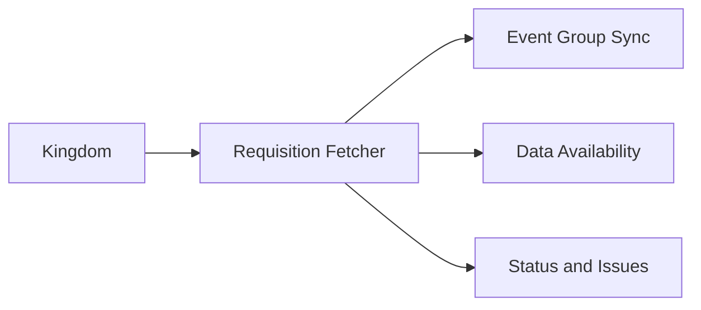
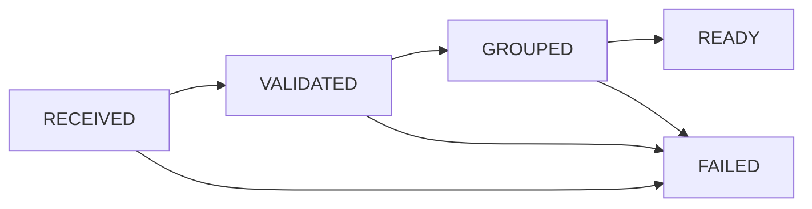
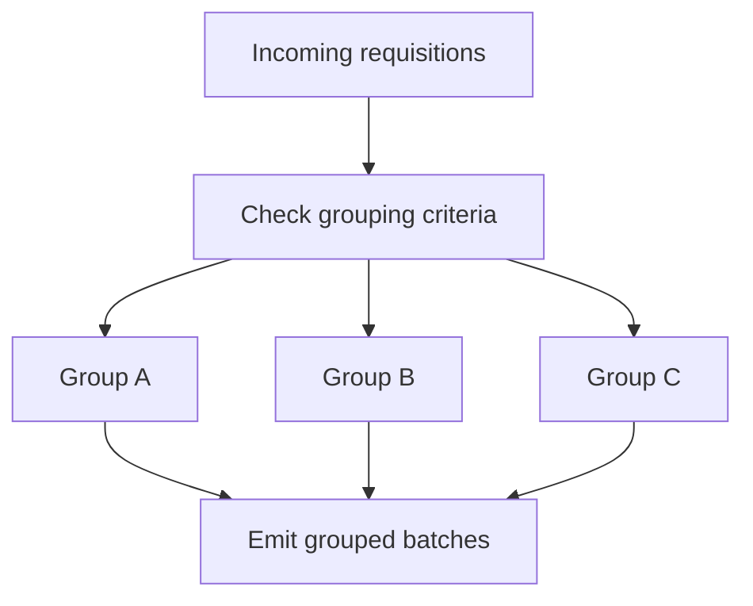
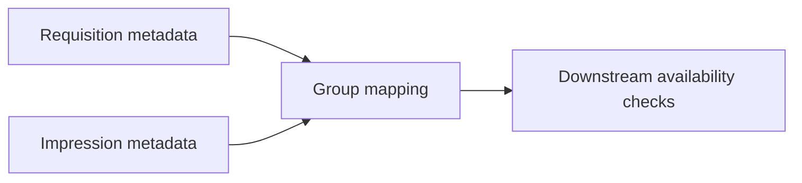
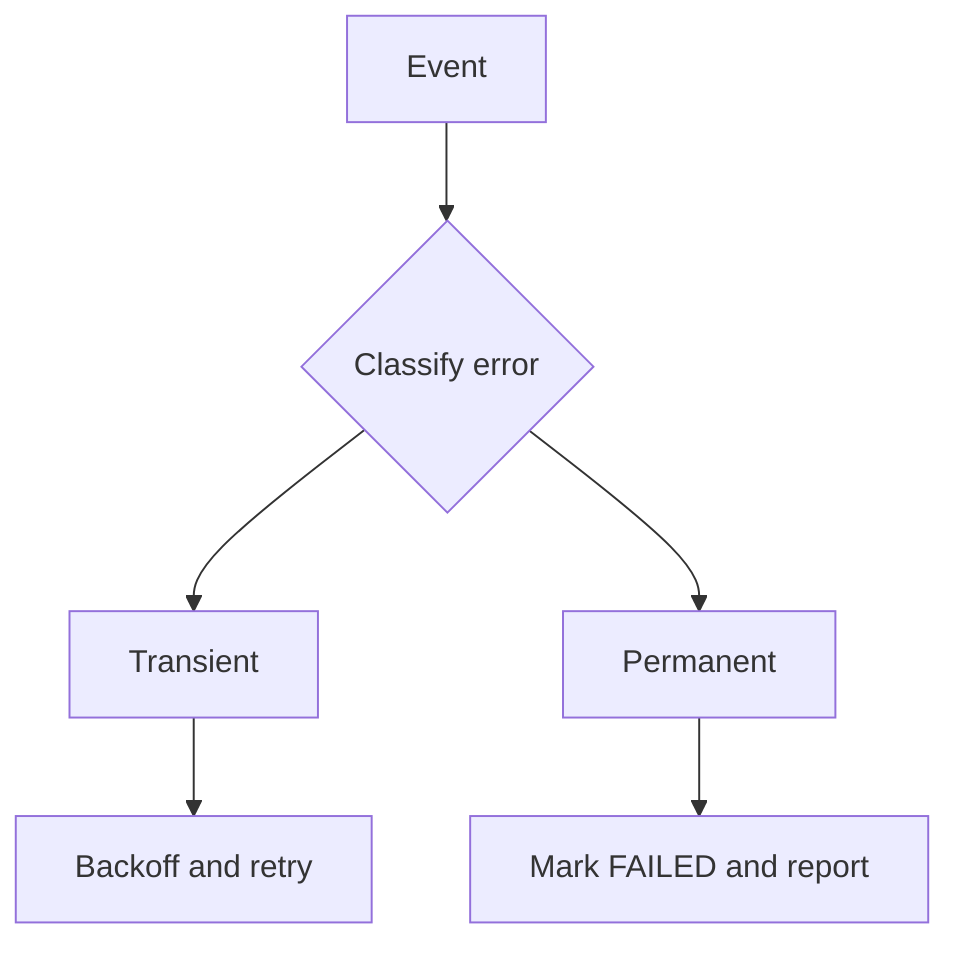
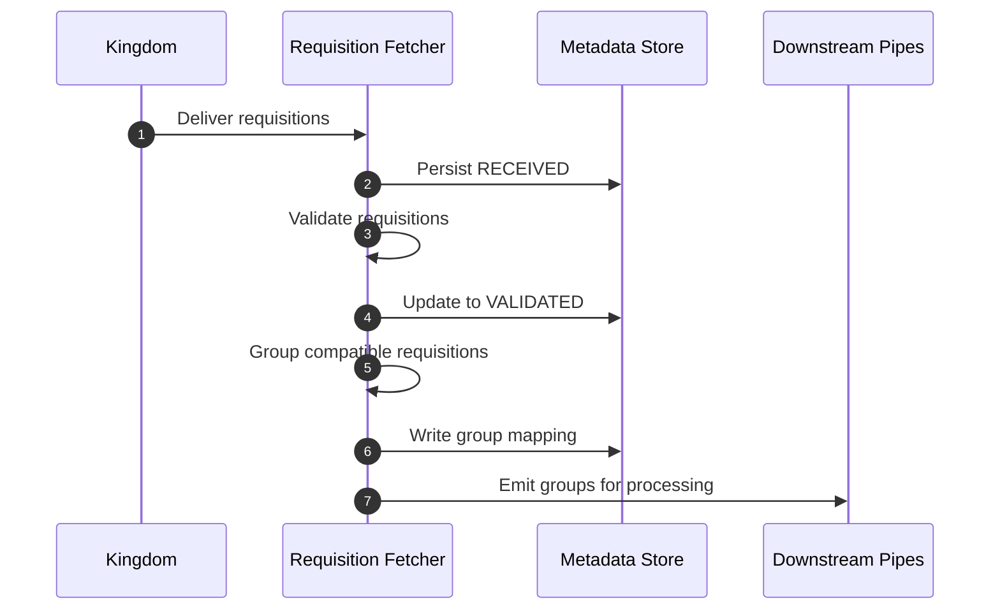
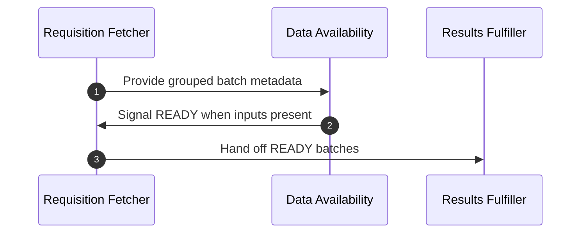

### EDP Aggregator: Requisition Fetcher Deep Dive

This document details the Requisition Fetcher in the EDP Aggregator: responsibilities, state handling, grouping logic, validation, APIs and data model, scheduling, failure modes, and end to end flows. It references code under `src/main/kotlin/org/wfanet/measurement/edpaggregator/requisitionfetcher/...` and protos under `src/main/proto/wfa/measurement/edpaggregator/v1alpha/...`.

Contents
- Responsibilities and role
- Inputs and outputs
- State model and transitions
- Grouping strategies
- Validation checks
- Data model and storage
- Scheduling and backpressure
- Error handling and retries
- Sequence flows
- Configuration knobs
- Repository pointers

### Responsibilities and role

The Requisition Fetcher is the entry component for measurement work inside the EDP Aggregator. It:
- Receives requisitions from the Kingdom and persists metadata
- Validates requisitions and prerequisites (auth, schema, references)
- Groups compatible requisitions into batches for efficient fulfillment
- Emits grouped batches for downstream components (Event Group Sync, Data Availability, Results Fulfiller)
- Reports statuses and issues back to the Kingdom

### Inputs and outputs

Inputs
- Requisition messages or pulls from Kingdom APIs
- Existing metadata in storage for dedupe and state

Outputs
- Grouped requisitions for downstream processing
- Status updates and error reports to Kingdom
- Persisted metadata updates

### State model and transitions

Typical requisition lifecycle states maintained by the Aggregator:
- RECEIVED: accepted from Kingdom and persisted
- VALIDATED: basic checks passed
- GROUPED: assigned to a processing group
- READY: prerequisites satisfied, can proceed to fulfillment
- FAILED: terminal error recorded

Notes
- Some transitions can be retried or revalidated if upstream inputs change
- READY indicates the batch can move to Data Availability and Results fulfillment

### Grouping strategies

Grouping combines requisitions that share compatible characteristics to reduce IO and compute overhead. Typical criteria:
- Same report or measurement target
- Compatible time windows and filters
- Consistent privacy policy and result type
- Homogeneous fulfillment mode (direct vs shuffle)

### Validation checks

Before grouping and emission, the Fetcher validates each requisition and its references. Representative checks (see tests under `requisitionfetcher`):
- Identity and authorization fields present
- Referenced event groups exist and are consistent
- Blob references non empty and syntactically valid
- Required encryption key descriptors present
- Report or measurement spec fields well formed

Validation outcomes:
- Pass: advance to grouping
- Soft failure: record issue and hold for retry
- Hard failure: mark FAILED and report to Kingdom

### Data model and storage

Protos:
- `edpaggregator/v1alpha/requisition_metadata.proto`
- `edpaggregator/v1alpha/grouped_requisitions.proto`
- `edpaggregator/v1alpha/blob_details.proto`

Storage tables (Spanner DDL under `src/main/resources/edpaggregator/spanner/`):
- Requisition metadata table: per requisition state, references, timestamps
- Group mapping table: group id, membership, grouping keys
- Impression metadata table: event artifacts and validation flags

### Scheduling and backpressure

The Fetcher should:
- Poll or receive notifications at a configured cadence
- Enforce concurrency limits when emitting groups
- Back off on repeated soft failures
- Avoid duplicating emission for the same requisition id

### Error handling and retries

Classes of errors:
- Transient: network timeouts, temporary auth failures, storage latency
- Permanent: invalid references, malformed specs, unsupported modes

Policies:
- Transient errors trigger exponential backoff and revalidation
- Permanent errors mark requisitions FAILED and notify Kingdom

### Sequence flows

Fetch and group flow:

Ready to fulfill flow:

### Configuration knobs

Key configs (see `config/edpaggregator/requisition_fetcher_config.proto` and related):
- Poll interval and batch sizes
- Max concurrent groups in flight
- Grouping keys and compatibility tolerances
- Retry backoff parameters

### Repository pointers

- Kotlin: `src/main/kotlin/org/wfanet/measurement/edpaggregator/requisitionfetcher/`
- Protos: `src/main/proto/wfa/measurement/edpaggregator/v1alpha/`
- Tests: `src/test/kotlin/org/wfanet/measurement/edpaggregator/requisitionfetcher/`

