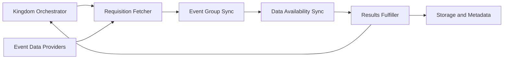
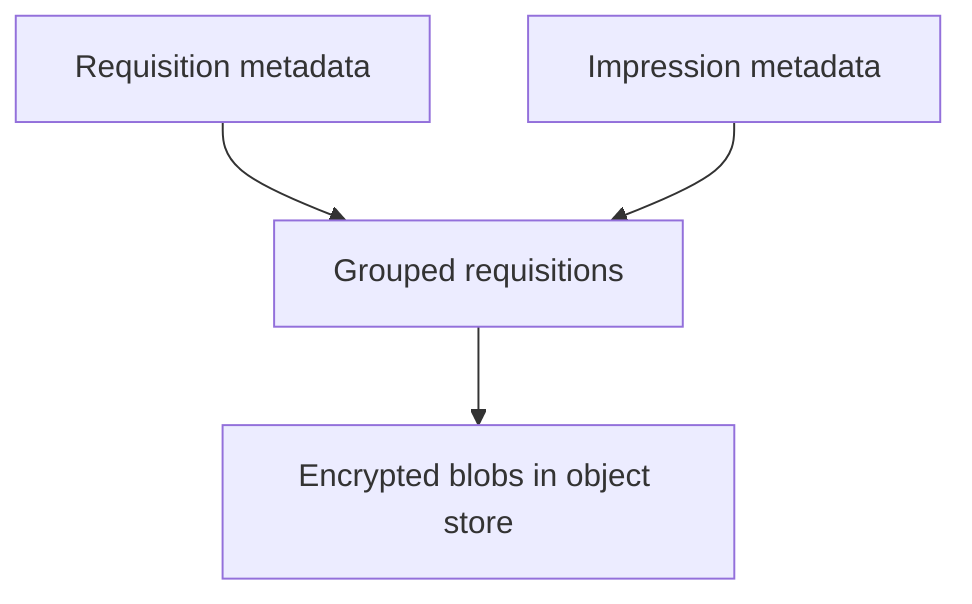
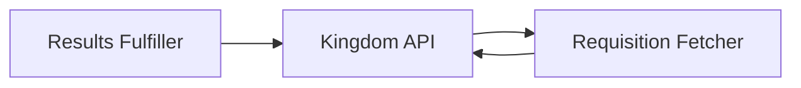
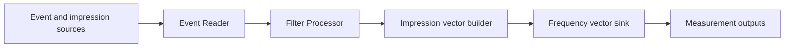
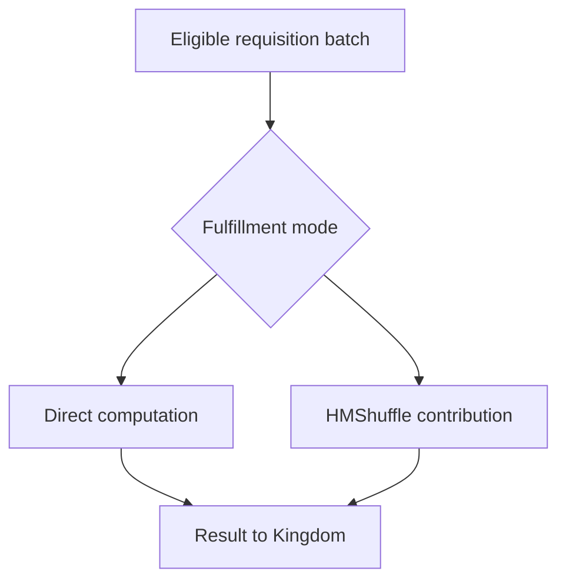
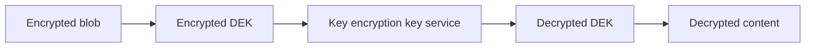
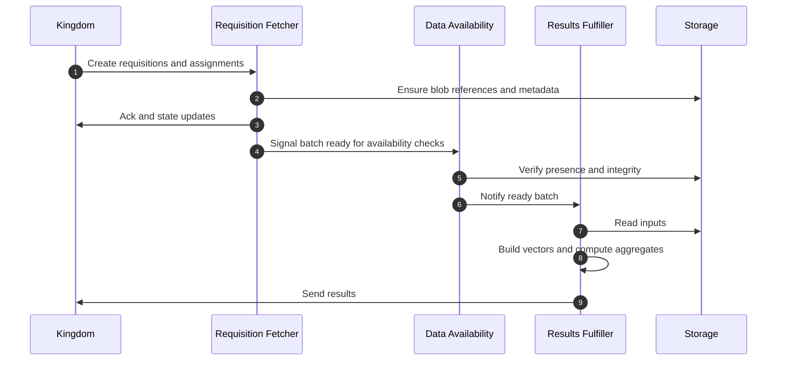

### EDP Aggregator: Architecture and Data Flow

This document explains how the EDP Aggregator works: its components, storage, control flow, and how it produces measurement results. It references code and protos under `src/main/kotlin/org/wfanet/measurement/edpaggregator/...` and `src/main/proto/wfa/measurement/edpaggregator/...`.

Sections
- Components overview
- Storage and metadata
- Control plane interactions
- Data processing pipeline
- Results fulfillment modes
- Crypto and key handling
- End to end sequence

### Components overview

- Requisition Fetcher: fetches and groups requisitions, validates prerequisites.
- Event Group Sync: syncs event group metadata and mapping.
- Data Availability Sync: tracks blob presence and readiness in storage.
- Results Fulfiller: reads eligible inputs and produces results for the Kingdom.
- Storage and Metadata: encrypted object storage plus metadata in Spanner or equivalent.

### Storage and metadata

Relevant files:
- Schema SQL: `src/main/resources/edpaggregator/spanner/...`
- Protos: `src/main/proto/wfa/measurement/edpaggregator/v1alpha/...`

Key entities:
- Requisition metadata: state of each requisition and references to blobs.
- Impression metadata: event level artifact references and validation flags.
- Grouped requisitions: batches that can be processed together.

### Control plane interactions

The Aggregator reacts to control plane signals and schedules:
- Receives requisitions from Kingdom
- Reports statuses and final results back to Kingdom
- Enforces policy and privacy budget configured by Kingdom

### Data processing pipeline

Internally, the Results Fulfiller runs a batched pipeline. Based on the test and implementation classes, a simplified view:

Notes
- Event Reader abstracts storage reads and format decoding.
- Filter Processor applies report filters such as time ranges and audience predicates.
- Impression vector builder prepares per user or per key frequencies suitable for reach and kplus reach computation.
- Frequency vector sink writes intermediate vectors for downstream aggregation or direct computation depending on the mode.

### Results fulfillment modes

Two primary modes are supported by the fulfillment layer:
- Direct mode: local computation of aggregates from available inputs
- HMShuffle mode: generation or consumption of shuffled contributions for a shuffle model pipeline

Related code:
- ResultsFulfillerApp and ResultsFulfiller
- DirectMeasurementResultFactory and builders for reach frequency impression
- HMShuffleMeasurementFulfiller for shuffle model

### Crypto and key handling

The aggregator reads encrypted blobs and unwraps data keys securely as configured:
- Envelope encryption with encrypted DEKs
- Service specific KEK integration
- Transport layer security parameters under `src/main/proto/wfa/measurement/config/edpaggregator/...`

### End to end sequence

### References in repo

- Kotlin implementation: `src/main/kotlin/org/wfanet/measurement/edpaggregator/...`
- Configuration protos: `src/main/proto/wfa/measurement/config/edpaggregator/...`
- API and metadata protos: `src/main/proto/wfa/measurement/edpaggregator/v1alpha/...`
- Spanner DDL: `src/main/resources/edpaggregator/spanner/...`

