# gRPC Gateway Architecture Diagram

This document shows the architecture of the gRPC Gateway and all connected services.

```mermaid
graph TB
    subgraph "Client Layer"
        Client[HTTP Client<br/>Browser/API Client]
    end

    subgraph "gRPC Gateway (Go)"
        Gateway[grpcgateway.go<br/>Port: 8443<br/>HTTPS Server]
        GatewayMux[runtime.ServeMux<br/>HTTP Router]
        GatewayConn[gRPC Client Connection<br/>TLS to Backend]
        
        Gateway --> GatewayMux
        GatewayMux --> GatewayConn
    end

    subgraph "Gateway Dependencies"
        Dep1[grpc-gateway/v2/runtime<br/>HTTP ↔ gRPC conversion]
        Dep2[google.golang.org/grpc<br/>gRPC client library]
        Dep3[reportingpb<br/>Generated from proto]
        Dep4[cmmspb<br/>Generated from proto]
        
        GatewayMux -.uses.-> Dep1
        GatewayConn -.uses.-> Dep2
        Gateway -.imports.-> Dep3
        Gateway -.imports.-> Dep4
    end

    subgraph "Registered Service Handlers (9 services)"
        Handler1[RegisterEventGroupsHandler]
        Handler2[RegisterMetricCalculationSpecsHandler]
        Handler3[RegisterMetricsHandler]
        Handler4[RegisterReportingSetsHandler]
        Handler5[RegisterReportsHandler]
        Handler6[RegisterImpressionQualificationFiltersHandler]
        Handler7[RegisterBasicReportsHandler]
        Handler8[RegisterDataProvidersHandler]
        Handler9[RegisterEventGroupMetadataDescriptorsHandler]
        
        GatewayMux --> Handler1
        GatewayMux --> Handler2
        GatewayMux --> Handler3
        GatewayMux --> Handler4
        GatewayMux --> Handler5
        GatewayMux --> Handler6
        GatewayMux --> Handler7
        GatewayMux --> Handler8
        GatewayMux --> Handler9
    end

    subgraph "Backend: Reporting Public API Server (Kotlin)"
        BackendServer[V2AlphaPublicApiServer<br/>gRPC Server<br/>Port: 8443]
        
        subgraph "Rate Limiter Location"
            RateLimiter[RateLimitingServerInterceptor<br/>TokenBucket Algorithm<br/>Per-method & per-principal limits]
        end
        
        subgraph "Service Implementations"
            Svc1[EventGroupsService]
            Svc2[MetricCalculationSpecsService]
            Svc3[MetricsService]
            Svc4[ReportingSetsService]
            Svc5[ReportsService]
            Svc6[ImpressionQualificationFiltersService]
            Svc7[BasicReportsService]
            Svc8[DataProvidersService]
            Svc9[EventGroupMetadataDescriptorsService]
        end
        
        BackendServer --> RateLimiter
        RateLimiter --> Svc1
        RateLimiter --> Svc2
        RateLimiter --> Svc3
        RateLimiter --> Svc4
        RateLimiter --> Svc5
        RateLimiter --> Svc6
        RateLimiter --> Svc7
        RateLimiter --> Svc8
        RateLimiter --> Svc9
    end

    subgraph "Backend Dependencies"
        BackendDep1[Internal Reporting Server<br/>InternalReportingSetsService<br/>InternalReportsService]
        BackendDep2[Kingdom API<br/>KingdomEventGroupsService<br/>KingdomDataProvidersService]
        BackendDep3[Authorization Service]
        BackendDep4[Database<br/>Cloud Spanner]
        
        Svc1 --> BackendDep2
        Svc2 --> BackendDep1
        Svc3 --> BackendDep1
        Svc4 --> BackendDep1
        Svc5 --> BackendDep1
        Svc7 --> BackendDep1
        Svc8 --> BackendDep2
        Svc9 --> BackendDep2
        Svc1 --> BackendDep3
        Svc2 --> BackendDep3
        Svc3 --> BackendDep3
        Svc4 --> BackendDep3
        Svc5 --> BackendDep3
        Svc6 --> BackendDep3
        Svc7 --> BackendDep3
        Svc8 --> BackendDep3
        Svc9 --> BackendDep3
        BackendDep1 --> BackendDep4
    end

    Client -->|HTTPS Request<br/>JSON| Gateway
    Gateway -->|HTTPS Response<br/>JSON| Client
    
    Handler1 -.gRPC call<br/>protobuf.-> BackendServer
    Handler2 -.gRPC call<br/>protobuf.-> BackendServer
    Handler3 -.gRPC call<br/>protobuf.-> BackendServer
    Handler4 -.gRPC call<br/>protobuf.-> BackendServer
    Handler5 -.gRPC call<br/>protobuf.-> BackendServer
    Handler6 -.gRPC call<br/>protobuf.-> BackendServer
    Handler7 -.gRPC call<br/>protobuf.-> BackendServer
    Handler8 -.gRPC call<br/>protobuf.-> BackendServer
    Handler9 -.gRPC call<br/>protobuf.-> BackendServer
    
    GatewayConn -.TLS Connection.-> BackendServer

    style Gateway fill:#e1f5ff
    style RateLimiter fill:#ffcccc
    style BackendServer fill:#ffe1cc
    style Client fill:#e1ffe1
```

## Request Flow

1. **Client** sends HTTPS request with JSON payload
2. **Gateway** receives HTTP request on port 8443
3. **GatewayMux** routes request to appropriate handler (e.g., `RegisterEventGroupsHandler`)
4. **Handler** converts HTTP/JSON → gRPC/protobuf
5. **GatewayConn** sends gRPC call over TLS to backend server
6. **Backend Server** receives gRPC request
7. **Rate Limiter** checks if request is allowed (TokenBucket algorithm)
   - If rate limit exceeded: returns `UNAVAILABLE` status
   - If allowed: proceeds to service
8. **Service** processes request (may call internal services, Kingdom API, database)
9. **Service** returns gRPC response (protobuf)
10. **Rate Limiter** response passes through
11. **Gateway** receives gRPC response
12. **Handler** converts gRPC/protobuf → HTTP/JSON
13. **Gateway** returns HTTPS response to client

## Service Mappings

| Gateway Handler | Backend Service | Proto Package |
|----------------|-----------------|---------------|
| `RegisterEventGroupsHandler` | `EventGroupsService` | `wfa.measurement.reporting.v2alpha` |
| `RegisterMetricCalculationSpecsHandler` | `MetricCalculationSpecsService` | `wfa.measurement.reporting.v2alpha` |
| `RegisterMetricsHandler` | `MetricsService` | `wfa.measurement.reporting.v2alpha` |
| `RegisterReportingSetsHandler` | `ReportingSetsService` | `wfa.measurement.reporting.v2alpha` |
| `RegisterReportsHandler` | `ReportsService` | `wfa.measurement.reporting.v2alpha` |
| `RegisterImpressionQualificationFiltersHandler` | `ImpressionQualificationFiltersService` | `wfa.measurement.reporting.v2alpha` |
| `RegisterBasicReportsHandler` | `BasicReportsService` | `wfa.measurement.reporting.v2alpha` |
| `RegisterDataProvidersHandler` | `DataProvidersService` | `wfa.measurement.api.v2alpha` |
| `RegisterEventGroupMetadataDescriptorsHandler` | `EventGroupMetadataDescriptorsService` | `wfa.measurement.api.v2alpha` |

## Rate Limiter Details

**Location:** `src/main/kotlin/org/wfanet/measurement/common/grpc/RateLimitingServerInterceptor.kt`

**Implementation:** Token Bucket Algorithm (`TokenBucket.kt`)

**Configuration:** `RateLimitConfig` protobuf
- Per-method rate limits
- Per-principal overrides
- Default rate limits

**Applied to:** All services in the Reporting Public API Server via gRPC interceptor chain

**Note:** Rate limiting is NOT in the gateway - it's in the backend server. The gateway is a transparent proxy.

