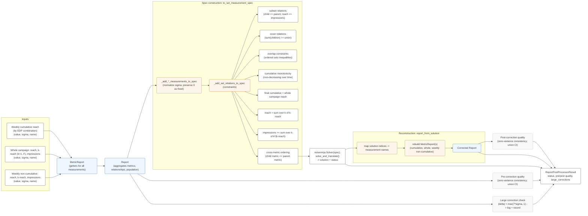

### Noise Correction Flow (Mermaid)

#### Render locally (optional)

- With VS Code or Cursor: many Markdown preview plugins render Mermaid blocks natively.
- With Mermaid CLI (mmdc):
  - npm i -g @mermaid-js/mermaid-cli
  - mmdc -i docs/noise-correction-flow-mermaid.md -o docs/noise-correction-flow.png

